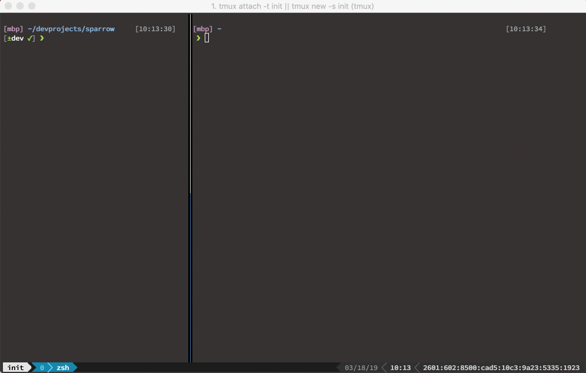

# what?
User friendly install that leverages the functionality of the following awesome produtivity boosters:
- https://github.com/junegunn/fzf
- https://github.com/rupa/z


Seriously check em out for details

# installation

```
$0 -c "$(curl -fsSL https://github.com/willpnw/dotfiles/raw/master/scripts/installFzf.sh)"
```
*yes $0 so the shell is known*

## Verified in zsh and bash on:
- Linux Mint 18.2 (Sonya)
- Ubuntu 18.04.2 LTS (Bionic Beaver)
- Ubuntu 16.04.6 LTS (Xenial Xerus)
- CentOS 7.6



### jump
List previous directories and jump to selected directory
```
jump
```

### locate
Pull up all files matching string, print the location of the match and optionally cd location of file
```
loc
```

### loce
Same as loc above, but edit the file returned. i.e. edit any file from anywhere
```
loce
```

### edit
Recursively search for filenames and open/edit selected file with user's default editor
```
edit
```

### redo
Pullup any previously entered command, giving the user the option to modify before running
```
redo
```

### killp
List all processes and kill selected process
```
killp
```

### alist
Find an alias and run it
```
alist
```

### dstop
Find a container by id and stop it
```
dstop
```

### dstart
Find a container by id and start it
```
dstart
```
